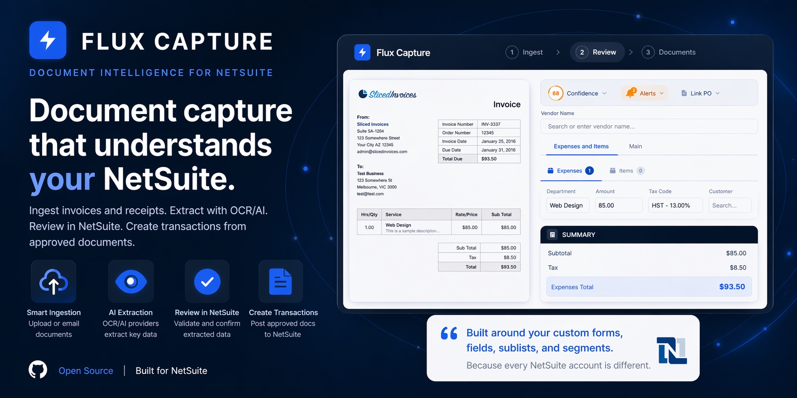

# Flux Capture



Flux Capture is an open source document capture SuiteApp for NetSuite. It helps accounts payable teams ingest invoices and receipts, extract fields with OCR/AI providers, review the results in NetSuite, and create transactions from approved documents.

The main idea: document capture should understand your NetSuite account, not force your process into a generic invoice template. Flux Capture is built around custom transaction forms, custom fields, sublists, custom segments, and the messy real-world configuration that makes every NetSuite environment different.

[](https://www.netsuite.com/)
[](https://docs.oracle.com/en/cloud/saas/netsuite/ns-online-help/)
[](LICENSE)

This project is not affiliated with, certified by, or endorsed by Oracle NetSuite.

## Why Use This Instead Of Another Capture Tool?

Most document capture products are good at the same demo: vendor, invoice number, date, subtotal, tax, total. The hard part starts after that, when the bill has to land in your actual NetSuite transaction form with your fields, your approval workflow, your coding rules, and your line-level requirements.

Flux Capture is aimed at that deeper layer:

- It can work with every body field on supported NetSuite transaction records, not only a fixed set of invoice fields.
- It supports custom fields such as `custbody_*`, line/sublist fields such as `custcol_*`, custom segments, departments, classes, locations, accounts, items, and memo-style fields.
- It lets users import the XML definition of a NetSuite transaction form, then choose which tabs, field groups, fields, sublists, and columns should appear in the capture workflow.
- It stores form schemas and form layouts in NetSuite so the review UI can mirror how your account actually creates bills, credits, POs, expense reports, invoices, sales orders, and journal entries.
- It has a learning layer for vendor aliases, account coding, segment mappings, item mappings, date formats, amount formats, and custom field mappings.
- It keeps the source open and deployable through SDF, so you can adapt it to your own NetSuite implementation instead of waiting for a vendor roadmap.

## Deep Dive: NetSuite-Native Form Intelligence

Flux Capture treats NetSuite form metadata as a first-class part of document capture.

### Custom Form XML Import

From Settings, users can upload a NetSuite custom transaction form XML export. Flux Capture parses the XML, shows the detected tabs and sublists, and lets the user select only the pieces they want in the capture experience. This is useful when the account has heavily customized vendor bill, vendor credit, purchase order, invoice, sales order, expense report, or journal entry forms.

The imported configuration can include:

- Form tabs and tab ordering
- Field groups and group labels
- Body fields, including custom transaction body fields
- Sublists such as expense, item, landed cost, and line
- Sublist columns, including custom transaction column fields
- Field visibility, labels, ordering, and display choices

### Dynamic Schema Extraction

When XML is not available, the SuiteApp can also extract record metadata from NetSuite using SuiteScript. The schema extractor discovers fields, field types, select options, and known sublists for supported transaction records, then stores that configuration in `customrecord_flux_config`.

That means the review screen can render a transaction-aware editor instead of a generic fixed invoice form.

### Every Transaction Field Is Mappable

Flux Capture is designed so extracted document data can flow into standard and custom transaction fields. The review UI and learning engine both understand body fields and sublist fields, so a team can map document labels like "Job", "Project Code", "Grant", "Department", "GL Account", "PO Ref", or vendor-specific fields into the NetSuite fields that matter to them.

This matters for accounts where successful automation depends on more than total amount accuracy. If a required approval field, segment, custom classification, or line column is missing, the bill still gets stuck. Flux Capture brings those fields into the capture process.

## Use It If Your NetSuite Account Is Not Vanilla

Flux Capture is especially useful when:

- Vendor bills have required approval fields, project fields, or custom classifications
- Line items need account, department, class, location, item, memo, tax, project, or custom column values
- Different subsidiaries or transaction types use different forms
- Your AP team needs to review extracted document data in the same shape as the final NetSuite transaction
- Your capture rules need to evolve by vendor, document layout, or account coding history

## Features

- Document upload and queue management for vendor bills, receipts, credit memos, expense reports, purchase orders, invoices, sales orders, and journal entries
- OCR/extraction provider abstraction with OCI Document Understanding, Azure Form Recognizer, and Mindee provider modules
- Field extraction for vendors, invoice numbers, dates, amounts, PO references, payment terms, and line items
- Dynamic transaction form rendering based on imported XML, server-extracted schema, or manual configuration
- Support for standard fields, custom body fields, custom column fields, custom segments, and transaction sublists
- Vendor matching and PO matching helpers
- Fraud and quality signals such as duplicate invoice checks, amount anomalies, date validation, and line-total reconciliation
- Review UI with document preview, editable extracted fields, confidence signals, and transaction creation workflows
- Email capture plugin for inbound invoice attachments
- Learning helpers for corrections, aliases, and vendor-specific patterns

## Requirements

- NetSuite account with SuiteScript enabled
- SuiteCloud CLI for project deployment
- Node.js 18 or newer for local helper scripts
- Optional OCR/AI provider credentials, depending on which provider you configure

## Quick Start

Install dependencies:

```bash
npm install
```

Authenticate SuiteCloud CLI:

```bash
suitecloud account:setup
```

Deploy the SuiteCloud project:

```bash
cd src
suitecloud project:deploy
```

After deployment, open the Flux Capture Suitelet in NetSuite and configure providers from Settings.

## Project Structure

```text
.
├── src/
│   ├── manifest.xml
│   ├── deploy.xml
│   ├── Objects/
│   │   ├── customrecord_flux_config.xml
│   │   ├── customrecord_flux_document.xml
│   │   └── customscript_*.xml
│   └── FileCabinet/SuiteApps/com.flux.capture/
│       ├── App/
│       ├── client/
│       ├── lib/
│       ├── scripts/
│       └── suitelet/
├── docs/
├── scripts/
├── suitecloud.config.js
└── package.json
```

## Architecture

The app is built around a small set of NetSuite entry points:

| Component | Type | Purpose |
| --- | --- | --- |
| `FC_Suitelet.js` | Suitelet | Serves the NetSuite-hosted UI |
| `FC_Router.js` | RESTlet | API router for document, settings, provider, and transaction actions |
| `FC_ProcessDocuments_MR.js` | Map/Reduce | Async document processing and polling |
| `FC_ContinuePolling_SS.js` | Scheduled Script | Continues long-running extraction operations |
| `FC_Document_UE.js` | User Event | Triggers processing when Flux document records are created |
| `FC_EmailCapture_Plugin.js` | Email Capture Plugin | Creates Flux document records from inbound attachments |
| `FC_Engine.js` | Library | Extraction, validation, matching, anomaly detection, and learning orchestration |

## Development

Sync changed files into NetSuite:

```bash
npm run sync
```

Sync and deploy:

```bash
npm run sync:deploy
```

Build a local distribution package:

```bash
npm run build
```

Verify an installation through the RESTlet health endpoint:

```bash
npm run verify-installation -- --account ACCOUNT_ID --restlet-url RESTLET_URL
```

## Repository Automation

The included GitHub Actions workflow can deploy to NetSuite when configured with these repository secrets:

| Secret | Description |
| --- | --- |
| `NS_ACCOUNT_ID` | NetSuite account ID |
| `NS_CERTIFICATE_ID` | OAuth certificate ID |
| `NS_PRIVATE_KEY` | Base64-encoded private key |
| `NS_PASSKEY` | SuiteCloud CI passkey |

For public forks, leave those secrets unset and deploy manually from your own environment.

## License

Flux Capture is released under the [MIT License](LICENSE); contributions should keep any code deployed into NetSuite on permissive licenses.
